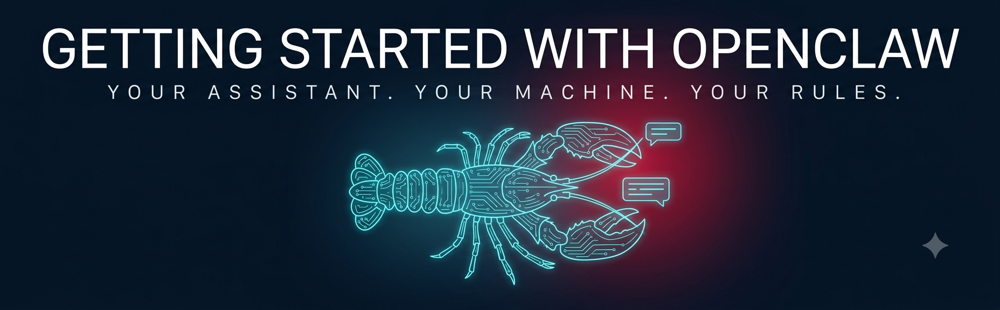
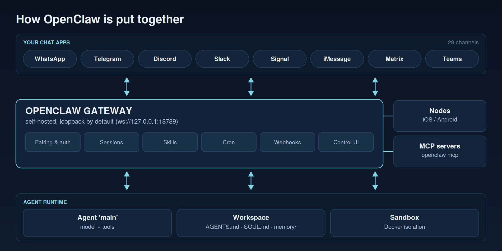
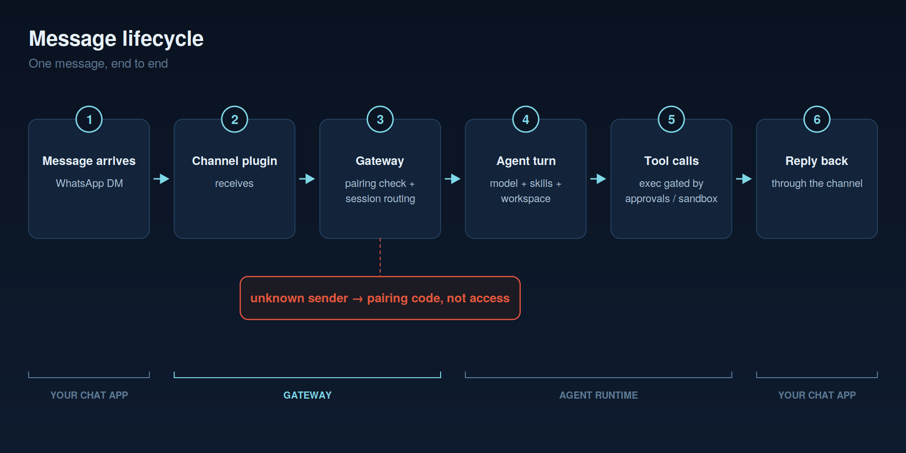
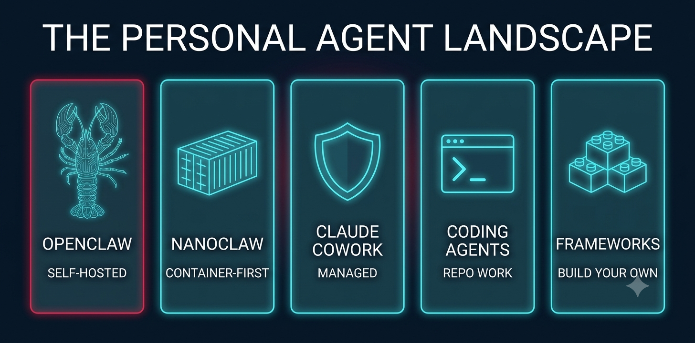

# Getting Started with OpenClaw

**A real personal AI assistant, running on your machine, living in your chat apps — and everything they don't tell you before you run the install script.**

[OpenClaw](https://github.com/openclaw/openclaw) went from side project to a quarter-million GitHub stars in a few months, and it earned it: this is the fastest route that exists today from "I want a personal agent" to *texting your own assistant on WhatsApp before dinner*. This repo is the guide I wanted when I set it up — written for students and anyone standing at the front door, and honest about the part the viral demos skip: **you are now the security team.**

Everything here was verified against a real install of **OpenClaw 2026.6.34** — the CLI output you'll see in these pages is captured from an actual machine, not transcribed from marketing.

---

## The mental model



OpenClaw has four ideas. Everything else is configuration.

**The Gateway is the product.** One self-hosted process on a machine you own. It binds to loopback (`ws://127.0.0.1:18789`), serves a browser Control UI on the same port, and owns everything: channel connections, sessions, skills, cron jobs, credentials. There is no cloud backend. When people say "my OpenClaw," they mean their Gateway.

**Channels are how you reach it.** WhatsApp, Telegram, Discord, Slack, Signal, iMessage, Matrix, Teams — about 29 in all. The assistant doesn't get a new app; it moves into the apps you already check. This is the design decision that made OpenClaw explode, and it is also the decision that makes access control matter (strangers can message those apps too — see the security chapter).

**Agents do the work.** An agent is a model plus tools plus a workspace — a real directory (`~/.openclaw/workspace`) with files that define who your assistant is: `AGENTS.md` for operating instructions, `SOUL.md` for personality, `USER.md` for who you are, `MEMORY.md` and a `memory/` folder of daily logs. It's git-initialized out of the box. Your assistant's entire character is a folder of markdown you can read and edit.

**Skills teach it tricks.** A skill is a folder with a `SKILL.md` — instructions plus metadata about what it needs. OpenClaw ships 52 of them (weather, GitHub, Google Workspace, 1Password, camera capture...), the ClawHub registry has thousands more from the community, and your agent can even draft its own for your review. Skills are also the sharpest edge on the whole system — a skill is text your agent obeys, and the ecosystem has already had a documented malicious one.

One message, end to end:



---

## Quickstart


```bash
# macOS / Linux
curl -fsSL https://openclaw.ai/install.sh | bash

# or, if you'd rather see what you're running before you run it:
npm install -g openclaw

openclaw onboard        # guided: gateway, workspace, model auth, channels, daemon
openclaw dashboard      # opens the Control UI at http://127.0.0.1:18789/
```

Type your first message in the Control UI, then do the one thing most people skip:

```bash
openclaw security audit
```

A fresh install reports a **CRITICAL** finding out of the box. That's not a bug in OpenClaw — it's the honest cost of the power you just installed, and fixing it takes five minutes. [The security chapter](docs/04-security-hardening.md) walks every finding.

---

## What's in this repo

| | What it covers |
| --- | --- |
| [**01 — What Is OpenClaw?**](docs/01-what-is-openclaw.md) | The story, the architecture, and what it deliberately is not |
| [**02 — Install & First Run**](docs/02-install-and-first-run.md) | Zero to a working assistant, with the real terminal output at every step |
| [**03 — Skills**](docs/03-skills.md) | The `SKILL.md` format, the 6-level loading order, ClawHub, and the skills your agent writes itself |
| [**04 — Security & Hardening**](docs/04-security-hardening.md) | The chapter that is the reason this repo exists. Threat model, the audit, the baseline |
| [**05 — Troubleshooting**](docs/05-troubleshooting.md) | Symptom-first fixes: gateway unreachable, channels, models, "needs setup" skills |
| [`examples/01-first-skill`](examples/01-first-skill/) | Build a morning-brief skill from scratch and schedule it |
| [`examples/02-hardened-config`](examples/02-hardened-config/) | The secure baseline `openclaw.json5`, annotated line by line |
| [`examples/03-remote-access`](examples/03-remote-access/) | Use it away from home without exposing your Gateway to the internet |

---

## Where OpenClaw sits in the landscape



The honest map as of mid-2026 — three different layers that get lumped together:

| | What it is | Reach for it when |
| --- | --- | --- |
| **OpenClaw** | Self-hosted personal assistant in your chat apps; maximal capability, maximal hackability | You want the most capable personal agent available and you accept owning its security posture |
| **NanoClaw** | Container-first minimal alternative; agent work isolated by default; a core you can read in a sitting | You'd rather trade breadth for a boundary you can reason about |
| **ZeroClaw / PicoClaw** | Tiny single-binary runtimes (Rust / Go) for edge boxes and VPSes | The machine is small and your needs are narrow |
| **Kimi Claw** | Hosted OpenClaw — one-click, always on | You want OpenClaw without owning a box, and you accept handing the keys to a host |
| **Claude Cowork** | Anthropic's managed agent workspace: skills, schedules, connected folders, guardrails included | You want the platform to carry the governance bill, inside its boundaries |
| **Manus / Perplexity Computer** | Hosted general agents, cloud- and browser-first | Convenience over hackability; nothing sensitive on your own metal |
| **Claude Code / Codex / Goose** | Coding agents — terminal-first work on repositories | The job is software, not life admin (OpenClaw happily *delegates* to these via its `coding-agent` skill) |
| **CrewAI / LangGraph** | Frameworks for *building* multi-agent systems | You're constructing a system, not adopting an assistant — a different layer of the stack entirely |

Three observations from actually running these:

**OpenClaw's genius and its risk are the same decision.** Messaging-first means zero new habits — and it means your assistant's front door is an app that strangers can also message. That's why pairing-by-default exists, and why [chapter 4](docs/04-security-hardening.md) is the longest one here.

**"Self-hosted" is a responsibility statement, not just a feature.** Cowork and the hosted platforms bound what you can do and carry the audit burden for you. OpenClaw inverts that: nothing is bounded, and the `openclaw security audit` command exists because the project knows exactly what it handed you.

**The frameworks are not competitors.** CrewAI and LangGraph (earlier in this series) are how you *build* agent systems. OpenClaw is what an agent *product* looks like when it's finished: identity files, memory, pairing, approvals, an audit command. Study it even if you never run it — it's a working answer key for the governance questions the frameworks leave open.

---

## When OpenClaw is the right tool — honestly

**Run it if** you want the most capable personal assistant that exists outside a lab, you have a machine that stays on, and you'll spend thirty minutes on the hardening chapter before you connect WhatsApp.

**Don't run it if** you need multi-tenant isolation (the threat model is explicitly one trusted operator), you can't patch a fast-moving project (releases ship near-daily), or "curl into bash on my primary machine" makes you flinch and you weren't going to read the script. For the bounded version of this idea, Claude Cowork exists. For a fleet of agents inside a regulated firm — that's [the deep end covered by the companion repo](https://github.com/steviebuchicago/claude-agents-for-wealth-management).

The theme of this whole series holds here in its purest form: **agents are easy — OpenClaw made a personal one an afternoon project. Governance is hard — and OpenClaw is rare in shipping you the tools to do it, then leaving the choice to you.**

---

## Repo layout

```
getting-started-with-openclaw/
├── docs/
│   ├── 01-what-is-openclaw.md        the story and the architecture
│   ├── 02-install-and-first-run.md   zero to working, real output
│   ├── 03-skills.md                  SKILL.md, ClawHub, the workshop
│   ├── 04-security-hardening.md      the governance chapter
│   ├── 05-troubleshooting.md         symptom-first fixes
│   └── images/                       diagrams + real terminal captures
│       └── _generate/                reproducible generators for every image
├── examples/
│   ├── 01-first-skill/               morning-brief, built from scratch
│   ├── 02-hardened-config/           annotated secure openclaw.json5
│   └── 03-remote-access/             nodes, Tailscale, no exposed ports
└── LICENSE
```

---

## License

MIT — see [LICENSE](LICENSE). Use it, fork it, teach with it.

## About

Built by **Stephen A. Barry** — Chief Technology Officer in asset and wealth management, and Professor of AI in the University of Chicago's MS in Applied Data Science. Part of a Fall 2026 series on agentic platforms.

Companions: [agents-are-easy-governance-is-hard](https://github.com/steviebuchicago/agents-are-easy-governance-is-hard) (the concepts) · [crewai-for-beginners](https://github.com/steviebuchicago/crewai-for-beginners) (your first multi-agent system) · [claude-agents-for-wealth-management](https://github.com/steviebuchicago/claude-agents-for-wealth-management) (the deep end).

[LinkedIn](https://www.linkedin.com/in/stevebarry25/) · [GitHub](https://github.com/steviebuchicago)
