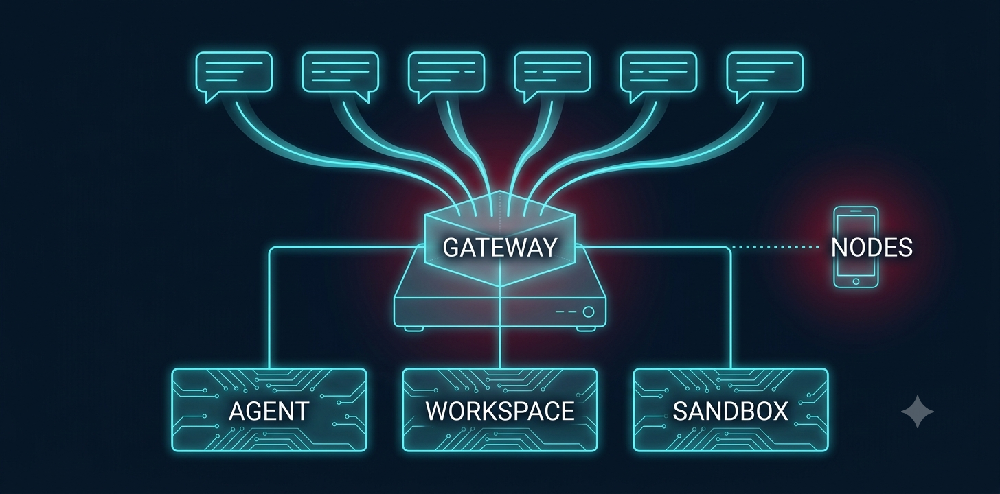
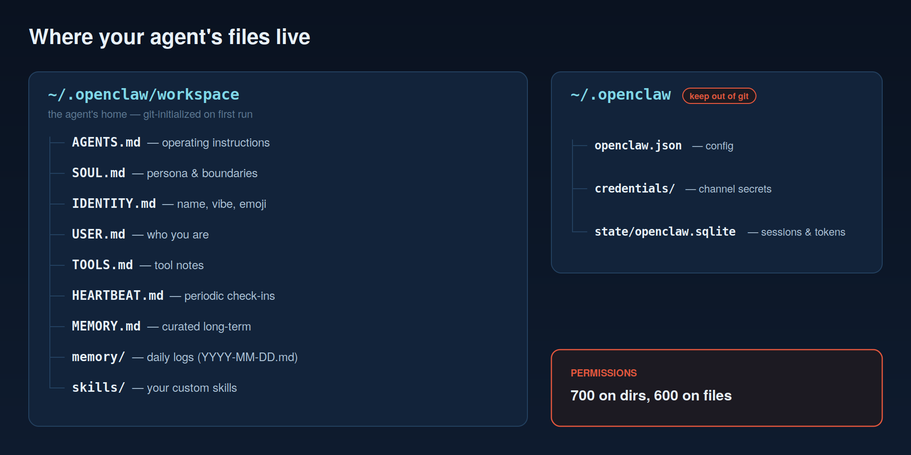

# 01 — What Is OpenClaw?

**An autonomous AI assistant that runs on your machine and talks to you through the chat apps you already use.**

That sentence sounds simple. The reasons it took until 2026 to exist, and then took over open source in a matter of weeks, are worth ten minutes of your time before you install anything.

---

## The short history

OpenClaw is the project of Austrian developer Peter Steinberger, and it has already lived four lives. It shipped in November 2025 as **Warelay**, grew out of an earlier assistant called Clawd, was renamed **Clawdbot** in early January 2026 as it went viral, became **Moltbot** on January 27 after a trademark complaint from Anthropic, and settled on **OpenClaw** three days later — because, in Steinberger's words, Moltbot "never quite rolled off the tongue."

The numbers behind the renames are the real story: by March 2, 2026 the repository had roughly **247,000 stars and 47,700 forks**, making it one of the fastest-growing open-source projects in GitHub's history. Steinberger joined OpenAI in February 2026, and stewardship of the project moved to an **OpenClaw Foundation**. Releases still ship at a startup pace — the stable line this guide was verified against is `2026.6.34`, with a beta channel typically a few weeks ahead.

Why did it explode? Because it collapsed the distance between "AI assistant" and *your actual life*. No new app. No tab to remember to open. The assistant is a contact in WhatsApp, and it was answering people's messages — checking calendars, running scripts, watching feeds — the same evening they installed it.

---

## What it actually is

Strip away the lobster memes and OpenClaw is a precise piece of engineering:

**One process, on your hardware.** The **Gateway** is a self-hosted service — a systemd user service on Linux, launchd on macOS — that binds to loopback at `ws://127.0.0.1:18789` and serves a browser **Control UI** on the same port. Configuration lives in `~/.openclaw/openclaw.json` (JSON5). Credentials, session state, and OAuth tokens live beside it. There is no OpenClaw cloud. Every capability and every risk in this guide lives on a box you control.

**Messaging as the interface.** Channel plugins connect the Gateway to WhatsApp, Telegram, Discord, Slack, Signal, iMessage, Matrix, Microsoft Teams, and more — about 29 channels. `openclaw channels add` walks the login flows. Inbound messages route through pairing and allowlist checks (chapter 4) before an agent ever sees them.

**Agents with a home directory.** Work is done by agents — model + tools + workspace. The workspace, `~/.openclaw/workspace` by default, is a plain, git-initialized directory:

`AGENTS.md` holds operating instructions. `SOUL.md` is personality and boundaries. `IDENTITY.md` is name, vibe, and emoji. `USER.md` is what it knows about you. `MEMORY.md` holds curated long-term memory, while `memory/` collects daily logs (`YYYY-MM-DD.md`) the agent can search without stuffing every prompt. This is the most quietly radical part of OpenClaw: **your assistant's character is markdown you can read, diff, and version.** There is also a heartbeat — every 30 minutes by default, the agent wakes and checks whatever `HEARTBEAT.md` tells it to, which is how "remind me" and "keep an eye on" actually work.

**Sessions keep conversations apart.** Each channel peer, group, or agent gets isolated conversation state (`~/.openclaw/agents/main/sessions`). Model context in this build defaults to a 272k-token window, and session scope is configurable — which matters the moment more than one person can reach your Gateway.

**Beyond the chat window.** Phone **nodes** (iOS/Android) pair by QR code and contribute camera and voice. A **sandbox** subsystem can run agent work in containers. An **MCP bridge** connects Model Context Protocol servers. **Cron** schedules background jobs, **webhooks** accept events from the outside world, and a plugin system extends all of it — plugins run in-process, which is a trust decision chapter 4 will make you sit with.

**Models are pluggable.** Claude, GPT (this build's default session model is `gpt-5.6-sol`), and local or hosted alternatives — configured per agent, checked with `openclaw models status`. OpenClaw is loyal to no lab, which is part of why every lab's users run it.

Here is one message moving through all of that:

---

## What it is not

Three boundaries save a lot of confusion:

**It is not multi-tenant.** The security model assumes **one trusted operator per Gateway** — you. It is a personal assistant, not a shared bot platform. Ten people with agents means ten Gateways (or accepted risk).

**It is not a hosted product.** Uptime, backups (`openclaw backup`), updates, and security posture are yours. Hosted derivatives exist for people who want out of that deal — at the cost of handing a third party the most privileged credential set you own.

**It is not a coding agent** — though it employs them. The bundled `coding-agent` skill delegates programming work to Codex, Claude Code, or OpenCode as background workers. OpenClaw's own job is broader and stranger: being *your* agent.

---

## Why this guide exists

The viral demos are real. So is this: OpenClaw is the most capability-dense thing most people will ever install on a personal machine — a process that reads your messages, holds your OAuth tokens, executes shell commands, browses with your cookies, and takes instructions over WhatsApp. The project itself is unusually honest about that; it ships pairing-by-default, exec approvals, sandboxing, and a genuinely good `openclaw security audit` command.

What it can't ship is the decision to use them. That's yours, and it's the thread running through every page that follows.

---

**Next:** [02 — Install & First Run](02-install-and-first-run.md) — zero to a working assistant, with the real terminal output.
