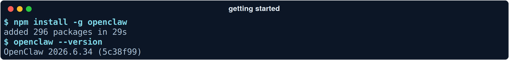
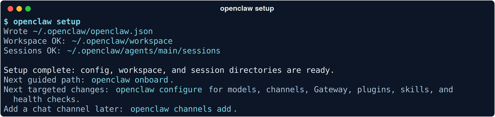
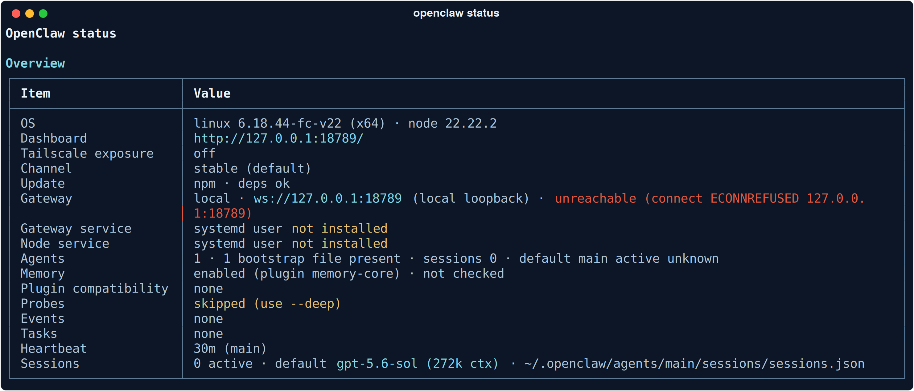

# From zero to a working assistant

**Installing OpenClaw takes about a minute. Deciding what it's allowed to do takes longer, and that part is on you.**

This is the hands-on chapter. By the end you'll have a Gateway running on your own machine, a workspace you can edit, and a Control UI you can talk to. Everything below was run on a real box against OpenClaw `2026.6.34` — the outputs in the screenshots are the actual ones, not mock-ups.

---

## What you need

**A machine that stays on.** This is the requirement people skim past. OpenClaw isn't a CLI you invoke; it's a Gateway process that holds your channel connections, runs scheduled jobs, and wakes the agent on a heartbeat. Close the lid and your assistant stops existing. A spare Mac mini, a home server, or a small VPS all work. A laptop you carry around does not, at least not well.

**A runtime, or the install script.** The npm path assumes Node is already there — this build was verified on Node 22.22.2, and `openclaw status` prints the version it sees. The install script is the option if you'd rather not think about it. For the current minimum Node version, check the live docs at [docs.openclaw.ai](https://docs.openclaw.ai).

**A model API key.** OpenClaw is model-agnostic — Claude, GPT, local or hosted. The default in this build's session config is `gpt-5.6-sol` with a 272k context window. Whatever you pick, `openclaw models status` will tell you whether the auth is actually working before you waste time debugging the wrong layer.

---

## Two install paths

The one-liner:

```bash
# macOS 15+ / Linux
curl -fsSL https://openclaw.ai/install.sh | bash

# Windows (PowerShell)
iwr -useb https://openclaw.ai/install.ps1 | iex
```

Or npm, if you already run Node — 296 packages, twenty-nine seconds, done:



Worth saying plainly: **`curl | bash` is you deciding to trust a script you haven't read.** That's a normal thing to do and I did it too, but this is a repo about running an agent with access to your life, so it's the right place to notice the decision rather than let it slide by. `npm install -g` has the same property with more steps.

---

## `onboard` vs `setup`

Two different entry points, and picking the wrong one is the most common early confusion.

| | `openclaw onboard` | `openclaw setup` |
| --- | --- | --- |
| **Mode** | Interactive wizard | Non-interactive |
| **Covers** | Gateway, workspace, model auth, channels, skills | Config file, workspace, session dirs |
| **Time** | QuickStart is minutes; full onboarding longer | Seconds |
| **Use it when** | This is your first install | You want a clean baseline to configure by hand |

`openclaw onboard` walks you through the Gateway, the workspace, provider sign-in, channel pairing and skills, and can install the background service for you with `--install-daemon`. The QuickStart path is genuinely a few minutes. The full version takes longer, and most of that isn't OpenClaw's fault — provider sign-in flows, channel pairing and model downloads run at their own pace.

`openclaw setup` is the non-interactive version. It writes the baseline and gets out of the way:



```
$ openclaw setup
Wrote ~/.openclaw/openclaw.json
Workspace OK: ~/.openclaw/workspace
Sessions OK: ~/.openclaw/agents/main/sessions

Setup complete: config, workspace, and session directories are ready.
Next guided path: openclaw onboard.
```

Three things exist now: a config file, a workspace, and a place for sessions. Nothing is running yet.

---

## First look around

`openclaw status` is the command you'll type most often. It's a single-screen answer to "what state is this thing in?"



Five rows carry most of the meaning:

**Dashboard — `http://127.0.0.1:18789/`.** The Control UI. Loopback only, which is the correct default and the thing you should be reluctant to change.

**Gateway — `ws://127.0.0.1:18789` (local loopback).** The hub process. On a fresh install this reads `unreachable (connect ECONNREFUSED 127.0.0.1:18789)`, which is not a bug — it means the Gateway isn't running yet. Same port as the Dashboard; the Control UI and the agent socket share it.

**Gateway service / Node service — `systemd user not installed`.** Nothing has been installed as a background service, so nothing survives a reboot. Expected until you install the daemon.

**Heartbeat — `30m (main)`.** The main agent wakes every thirty minutes. What it does when it wakes is controlled by `HEARTBEAT.md` in the workspace — and that file ships with comments only, which deliberately means no scheduled heartbeat calls until you write something into it. **Your agent is idle by default, on purpose.**

**Sessions — `0 active · default gpt-5.6-sol (272k ctx)`.** Conversation state, per agent, at `~/.openclaw/agents/main/sessions/sessions.json`.

The footer points at the next moves: `openclaw status --all` to share, `openclaw logs --follow` to watch live, `openclaw gateway probe` if reachability is the problem.

---

## The Control UI, and your first message

```bash
openclaw dashboard
```

That opens the Control UI at `http://127.0.0.1:18789/` with your current token already attached — which is why you use the command rather than typing the URL. Send a message, get a reply; that's your first turn. Typing `$` in the Control UI searches your skills, which is a fast way to see what the agent can currently reach.

If you'd rather stay in the terminal:

```bash
openclaw chat        # alias for: openclaw tui --local
```

---

## Connecting a channel later

The point of OpenClaw is that you talk to it from the chat apps you already use — WhatsApp, Telegram, Discord, Slack, Signal, iMessage, Matrix, Teams and more. You don't have to set that up on day one, and I'd argue you shouldn't.

```bash
openclaw channels add       # guided prompts
openclaw channels status    # connected accounts and login state
```

**The default for unknown DMs is pairing, and leave it that way.** An unfamiliar sender gets a time-limited code — it expires in an hour, and there's a cap of three pending requests per channel — which you approve with `openclaw pairing`. Allowlist and open modes exist. Open mode means anyone who finds your number is talking to an agent with access to your files.

---

## The workspace tour

The workspace is the agent's home directory, at `~/.openclaw/workspace` by default. It's git-initialized out of the box, which means **every change your agent makes to its own instructions is diffable** — worth appreciating, and worth actually reading occasionally.

The bootstrap files:

| File | What it holds |
| --- | --- |
| `AGENTS.md` | Operating instructions — startup behaviour, memory rules |
| `SOUL.md` | Persona, tone, boundaries |
| `IDENTITY.md` | Name, vibe, emoji |
| `USER.md` | Stable facts about you |
| `TOOLS.md` | Notes on available tools |
| `HEARTBEAT.md` | What to check on each periodic wake |
| `BOOTSTRAP.md` | First-run birth certificate; the agent deletes it when done |

Alongside those: `MEMORY.md` for curated long-term memory, and a `memory/` directory of daily logs named `YYYY-MM-DD.md`.

**Edit `SOUL.md` and `USER.md` first, and edit nothing else.** `SOUL.md` is where the assistant's character lives — the shipped version tells it to have opinions, be resourceful before asking, and be careful with anything external. `USER.md` is where you write the durable facts about yourself so you stop repeating them. Those two changes make more difference to daily usefulness than anything else on the list.

One rule in `AGENTS.md` is worth reading closely: `MEMORY.md` loads **only** in the main session, never in Discord or group chats or sessions with other people. That's a deliberate boundary between "things my assistant knows about me" and "rooms my assistant is standing in."

---

## Where things live

```
~/.openclaw/
├── openclaw.json                       config (JSON5)
├── credentials/                        channel + provider secrets
├── state/openclaw.sqlite               sessions, jobs, OAuth tokens
├── workspace/                          the agent's home (git-initialized)
└── agents/main/sessions/               per-agent conversation state
```

**Config and secrets are in `~/.openclaw`. The agent's editable brain is in `~/.openclaw/workspace`.** Back up both; the workspace is the part you'd actually miss.

---

## Run it as a service

Until you do this, your assistant dies when your shell does.

```bash
openclaw onboard --install-daemon    # systemd user unit on Linux, launchd on macOS
openclaw gateway status              # confirm it's up
```

Re-run `openclaw status` afterwards and those `systemd user not installed` rows should change.

---

## What tripped us

**Run `openclaw security audit` before you connect anything.** A fresh install reports one CRITICAL — `gateway.loopback_no_auth`. The Gateway binds loopback but has no auth secret configured, so `gateway.auth.mode="none"` leaves the HTTP APIs, including `/tools/invoke`, callable without a shared secret. On a machine only you touch, that's survivable. The moment anything sits in front of it, it isn't. Fix it now, while the install is boring: [`../examples/02-hardened-config/`](../examples/02-hardened-config/).

**Don't put the Control UI behind a proxy without auth and `trustedProxies`.** The audit warns about this separately and it's the same trap from two directions: a reverse proxy makes remote requests look local, and if `gateway.trustedProxies` is empty, that local-client check can be spoofed. Set the token *and* the trusted proxies, or keep it local-only and reach it another way — see [`../examples/03-remote-access/`](../examples/03-remote-access/).

**Stable is what npm gives you, and that's usually right.** `openclaw status` shows the channel as `stable (default)`. A beta channel exists and `openclaw update` will show you where you are. Beta gets new capability first; it also gets the new bugs first, on the process that holds your message accounts.

**"Unreachable" on a fresh install is not an error.** The Gateway simply isn't running. Start it, or install the service. If you keep landing there, [`05-troubleshooting.md`](05-troubleshooting.md) starts with exactly that symptom.

---

**Next:** [Teaching your assistant new tricks →](03-skills.md) — how skills work, where they load from, and the one that got caught exfiltrating data.
